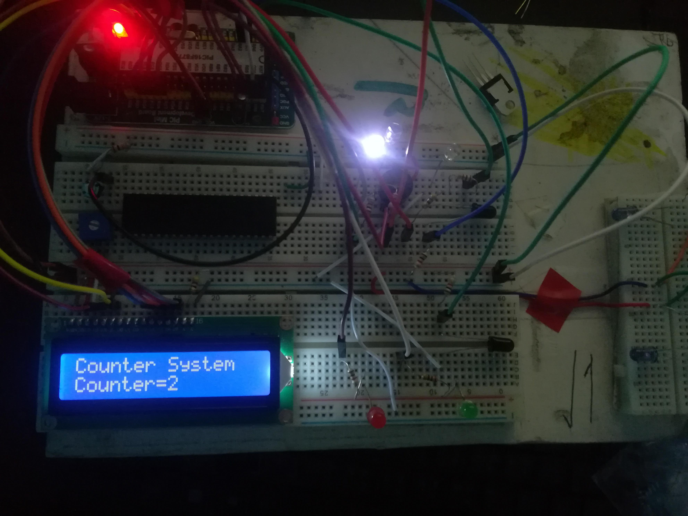

# Bidirectional Counter System

PIC Microcontroller base bidirectional counter system. IR sensors are used to detect entry and exit. Automatic on/off of lights are done according to current people available inside.
# Device

  
 

  

Components & Sensors:
  -  IR Pair
  -  PIC 16F877A
  -  16*2 LCD
  -  LED
  -  Crystal Oscillator
  -  Capacitor
  -  Resistors
  -  Breadboard

# Simulation

 

License
----

